## 1. 产品概述

睡眠门诊管理工作台是面向睡眠门诊医生、护士和随访专员的一体化Web应用，将PSQI量表评估、分层管理和复诊追踪整合在同一套工作台内，解决门诊纸笔登记效率低、人工追踪易遗漏的痛点。

- **核心目标**：减少门诊纸笔登记和人工追踪，帮助医护人员在忙碌门诊中快速判断患者优先级（谁该先回访、谁需要加号复诊、谁可以继续居家观察）
- **目标用户**：睡眠门诊医生、护士、随访专员
- **产品价值**：提高门诊效率，降低漏访率，提升睡眠障碍患者的全程管理质量

## 2. 核心功能

### 2.1 用户角色

| 角色 | 登录方式 | 核心权限 |
|------|----------|----------|
| 医生 | 账号密码登录 | 患者建档、PSQI评估录入、风险分层、复诊建议、干预记录、随访结论 |
| 护士 | 账号密码登录 | 患者信息录入、量表发放提醒、随访触达记录 |
| 随访专员 | 账号密码登录 | 随访任务执行、电话/短信触达记录、未完成量表提醒 |

### 2.2 功能模块

1. **患者列表**：患者信息管理、初诊建档、快速检索、风险分层筛选
2. **评估录入**：PSQI分项录入、总分自动计算、失眠主诉备注、症状前后对比
3. **随访计划**：随访任务自动生成、电话/短信触达记录、未完成量表提醒、干预记录
4. **预警看板**：异常高分患者预警、优先级排序、待处理任务统计
5. **统计报表**：患者分布、风险分层统计、随访完成率、干预效果分析

### 2.3 页面详情

| 页面名称 | 模块名称 | 功能描述 |
|---------|---------|----------|
| 患者列表 | 搜索筛选 | 按姓名、ID、风险等级、随访状态多维度筛选 |
| 患者列表 | 患者卡片 | 展示基本信息、最新PSQI评分、风险等级、下次随访时间 |
| 患者列表 | 初诊建档 | 录入患者基本信息、病史、过敏史、联系方式 |
| 评估录入 | PSQI量表 | 7个分项（睡眠质量、入睡时间、睡眠时间、睡眠效率、睡眠障碍、催眠药物、日间功能）0-3分评分，总分自动汇总 |
| 评估录入 | 主诉备注 | 失眠主诉自由文本、症状持续时间、加重/缓解因素 |
| 评估录入 | 症状对比 | 本次与上次PSQI评分对比、变化趋势可视化 |
| 评估录入 | 风险分层 | 根据总分自动标记风险等级（低<5、中5-10、高11-15、极高>15） |
| 随访计划 | 任务列表 | 自动生成的随访任务、优先级排序、完成状态 |
| 随访计划 | 触达记录 | 电话记录、短信发送记录、触达结果（成功/未接/拒接） |
| 随访计划 | 干预记录 | 用药记录（名称、剂量、频次）、非药物干预（CBT-I、睡眠卫生指导等） |
| 随访计划 | 复诊建议 | 系统根据风险等级自动建议复诊时间，支持手动调整 |
| 预警看板 | 高危预警 | 异常高分患者（>15分）醒目展示、快速处理入口 |
| 预警看板 | 优先级队列 | 按风险等级、逾期时间排序的待处理队列 |
| 预警看板 | 统计概览 | 今日待随访、逾期未访、高危患者数量统计 |
| 统计报表 | 患者分布 | 按年龄、性别、风险等级的患者分布图表 |
| 统计报表 | 随访统计 | 随访完成率、触达成功率、平均随访时长 |
| 统计报表 | 疗效分析 | PSQI评分变化趋势、干预有效率 |

## 3. 核心流程

```mermaid
flowchart LR
    A["初诊建档"] --> B["PSQI量表评估"]
    B --> C["总分自动计算"]
    C --> D["风险分层标记"]
    D --> E["复诊时间建议"]
    E --> F["随访任务自动生成"]
    F --> G["随访专员触达（电话/短信）"]
    G --> H["触达结果记录"]
    H --> I["干预方案记录"]
    I --> J["定期复评"]
    J --> K["症状前后对比"]
    K --> L["医生随访结论"]
    
    style A fill:#e3f2fd,stroke:#1565c0
    style B fill:#e8f5e9,stroke:#2e7d32
    style D fill:#fff3e0,stroke:#ef6c00
    style F fill:#fce4ec,stroke:#c2185b
```

**主流程说明**：
1. 患者初诊时，护士或医生录入患者基本信息完成建档
2. 医生进行PSQI量表评估，7个分项分别打分，系统自动计算总分
3. 系统根据PSQI总分自动进行风险分层（低/中/高/极高）
4. 系统根据风险等级自动建议下次复诊/随访时间
5. 随访任务自动进入随访专员待办队列
6. 随访专员进行电话/短信触达并记录结果
7. 记录用药和非药物干预方案
8. 定期复评时系统自动对比症状变化
9. 医生根据随访情况出具结论并留档

## 4. 用户界面设计

### 4.1 设计风格

- **设计基调**：专业医疗风格，清爽洁净，信息层级清晰，适合快速浏览和操作
- **主色调**：医疗蓝 (#1976D2) - 代表专业、信任
- **辅助色**：
  - 低风险：医疗绿 (#4CAF50)
  - 中风险：警示黄 (#FF9800)
  - 高风险：警示橙 (#F57C00)
  - 极高风险：紧急红 (#D32F2F)
- **背景色**：浅灰 (#F5F7FA) 为主，白色卡片 (#FFFFFF) 承载内容
- **按钮风格**：圆角8px，扁平化设计，主按钮实心填充，次按钮描边空心
- **字体**：
  - 标题：思源黑体 Bold，18-24px
  - 正文：思源黑体 Regular，14px
  - 数据/数字：Roboto Mono，13-16px（等宽字体便于数值对比）
- **布局风格**：左侧导航栏 + 顶部状态栏 + 主内容区的经典后台布局，卡片式内容承载
- **图标风格**：线性图标（Material Design Icons），统一24px尺寸

### 4.2 页面设计概述

| 页面名称 | 模块名称 | UI元素 |
|---------|---------|--------|
| 患者列表 | 顶部搜索栏 | 搜索框、筛选下拉（风险等级、随访状态）、新建患者按钮 |
| 患者列表 | 数据表格 | 患者信息列、PSQI分数列（带颜色标识）、风险等级标签、下次随访时间、操作列 |
| 评估录入 | PSQI录入表单 | 7组评分题组，每组0-3分单选按钮，右侧实时总分显示面板 |
| 评估录入 | 主诉区域 | 多行文本框、症状持续时间选择器、加重/缓解因素标签选择 |
| 评估录入 | 历史对比 | 左右对比卡片、分数变化箭头、趋势折线图 |
| 随访计划 | 任务看板 | 列视图（待联系/已联系/需复诊/已完成），卡片式任务 |
| 随访计划 | 触达记录 | 时间线布局，电话/短信图标区分，结果状态标签 |
| 预警看板 | 高危卡片 | 红色边框醒目卡片，大字体显示PSQI分数，紧急处理按钮 |
| 预警看板 | 优先级队列 | 按紧急程度排序的列表，逾期时间红色高亮 |
| 统计报表 | 图表区 | 柱状图（患者分布）、折线图（评分趋势）、饼图（风险占比） |
| 统计报表 | 数据卡片 | 关键指标大数字展示，环比变化百分比 |

### 4.3 响应式设计

- **桌面优先**：1920px为基准设计，支持1440px、1280px自适应
- **平板适配**：≥1024px保持完整功能，侧边栏可折叠
- **交互优化**：表格支持横向滚动，按钮最小44x44px触控区域

