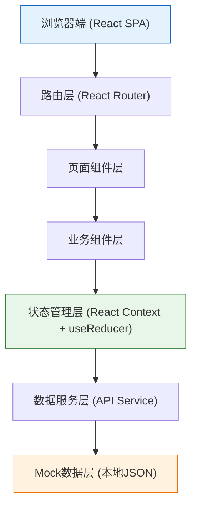
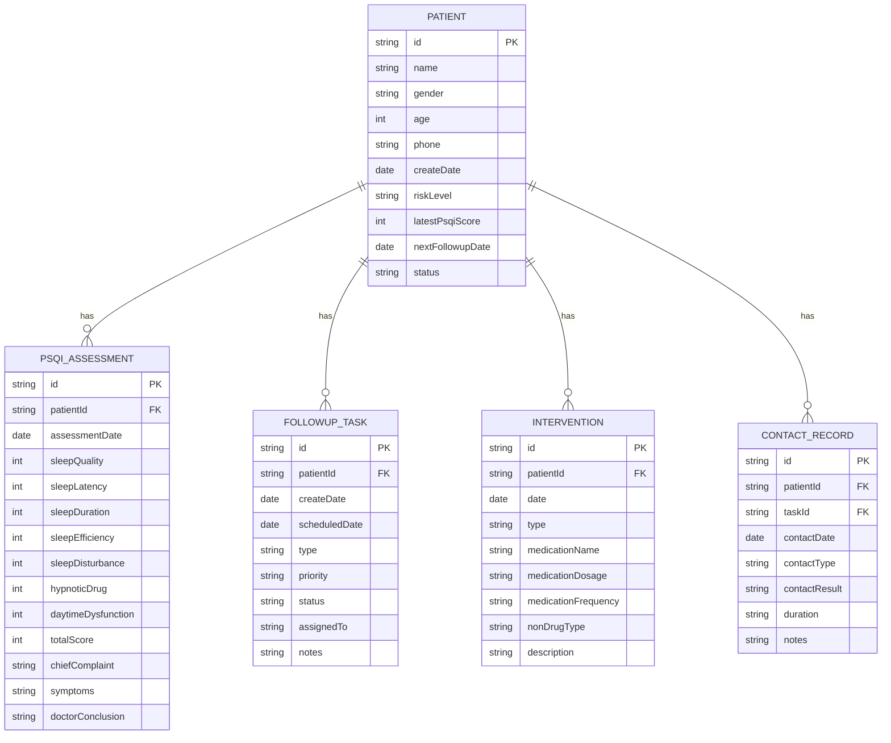

## 1. 架构设计



**架构说明**：
- 纯前端单页应用，使用Mock数据模拟后端接口
- 采用React Context进行全局状态管理
- 组件分层清晰，便于维护和扩展
- 数据服务层统一管理数据请求，便于后续接入真实后端

## 2. 技术描述

- **前端框架**：React@18 + TypeScript
- **构建工具**：Vite@5
- **样式方案**：TailwindCSS@3
- **路由管理**：React Router@6
- **图表库**：Recharts@2（轻量级React图表库）
- **图标库**：Lucide React@0.344（现代线性图标）
- **日期处理**：date-fns@3
- **状态管理**：React Context + useReducer（轻量级，避免过度设计）
- **数据持久化**：LocalStorage（保存用户操作和Mock数据）
- **初始化工具**：npm create vite@latest

## 3. 路由定义

| Route | 页面 | 说明 |
|-------|------|------|
| `/` | 患者列表 | 首页，展示所有患者列表 |
| `/patients` | 患者列表 | 患者信息管理、搜索筛选 |
| `/assessment/:patientId` | 评估录入 | PSQI量表评估录入页面 |
| `/followup` | 随访计划 | 随访任务管理、触达记录 |
| `/alert` | 预警看板 | 高危患者预警、优先级队列 |
| `/statistics` | 统计报表 | 数据统计分析图表 |

## 4. 数据模型

### 4.1 ER图



### 4.2 类型定义

```typescript
// 风险等级
export type RiskLevel = 'low' | 'medium' | 'high' | 'extreme';

// 随访任务状态
export type TaskStatus = 'pending' | 'in_progress' | 'completed' | 'cancelled';

// 触达结果
export type ContactResult = 'success' | 'no_answer' | 'rejected' | 'wrong_number';

// 患者基本信息
export interface Patient {
  id: string;
  name: string;
  gender: 'male' | 'female';
  age: number;
  phone: string;
  idCard?: string;
  address?: string;
  medicalHistory?: string;
  allergyHistory?: string;
  createDate: string;
  riskLevel: RiskLevel;
  latestPsqiScore: number;
  latestAssessmentDate?: string;
  nextFollowupDate?: string;
  status: 'active' | 'discharged' | 'lost';
}

// PSQI评估记录
export interface PsqiAssessment {
  id: string;
  patientId: string;
  assessmentDate: string;
  // PSQI 7个分项 (0-3分)
  sleepQuality: number;      // 1. 睡眠质量
  sleepLatency: number;      // 2. 入睡时间
  sleepDuration: number;     // 3. 睡眠时间
  sleepEfficiency: number;   // 4. 睡眠效率
  sleepDisturbance: number;  // 5. 睡眠障碍
  hypnoticDrug: number;      // 6. 催眠药物
  daytimeDysfunction: number;// 7. 日间功能
  totalScore: number;        // 总分 0-21
  chiefComplaint: string;    // 失眠主诉
  symptoms: string;          // 症状描述
  aggravatingFactors?: string; // 加重因素
  relievingFactors?: string;   // 缓解因素
  doctorConclusion?: string;  // 医生结论
}

// 随访任务
export interface FollowupTask {
  id: string;
  patientId: string;
  patientName: string;
  createDate: string;
  scheduledDate: string;
  type: 'phone' | 'sms' | 'clinic' | 'home';
  priority: 'low' | 'medium' | 'high' | 'urgent';
  status: TaskStatus;
  assignedTo: string;
  notes?: string;
  completedDate?: string;
}

// 干预记录
export interface Intervention {
  id: string;
  patientId: string;
  date: string;
  type: 'medication' | 'non_drug' | 'both';
  // 药物干预
  medicationName?: string;
  medicationDosage?: string;
  medicationFrequency?: string;
  // 非药物干预
  nonDrugType?: string;
  description?: string;
}

// 触达记录
export interface ContactRecord {
  id: string;
  patientId: string;
  taskId?: string;
  contactDate: string;
  contactType: 'phone' | 'sms' | 'wechat' | 'clinic';
  contactResult: ContactResult;
  duration?: number; // 通话时长(秒)
  notes?: string;
  operator: string;
}
```

## 5. 目录结构

```
src/
├── assets/              # 静态资源
├── components/          # 通用组件
│   ├── Layout/          # 布局组件
│   ├── RiskBadge/       # 风险等级标签
│   ├── ScoreDisplay/    # 分数显示组件
│   ├── PatientCard/     # 患者卡片
│   └── Modal/           # 弹窗组件
├── context/             # 全局状态
│   └── AppContext.tsx
├── data/                # Mock数据
│   ├── patients.ts
│   ├── assessments.ts
│   ├── tasks.ts
│   └── interventions.ts
├── pages/               # 页面组件
│   ├── PatientList/     # 患者列表
│   ├── Assessment/      # 评估录入
│   ├── Followup/        # 随访计划
│   ├── Alert/           # 预警看板
│   └── Statistics/      # 统计报表
├── services/            # 数据服务
│   ├── patientService.ts
│   ├── assessmentService.ts
│   └── followupService.ts
├── types/               # 类型定义
│   └── index.ts
├── utils/               # 工具函数
│   ├── psqi.ts          # PSQI计算工具
│   ├── risk.ts          # 风险分层工具
│   └── date.ts          # 日期工具
├── App.tsx
├── main.tsx
└── index.css
```

## 6. 核心工具函数

### PSQI总分计算与风险分层

```typescript
// PSQI总分计算（7个分项之和）
export const calculatePsqiTotal = (scores: {
  sleepQuality: number;
  sleepLatency: number;
  sleepDuration: number;
  sleepEfficiency: number;
  sleepDisturbance: number;
  hypnoticDrug: number;
  daytimeDysfunction: number;
}): number => {
  return Object.values(scores).reduce((sum, score) => sum + score, 0);
};

// 根据PSQI总分确定风险等级
export const getRiskLevel = (totalScore: number): RiskLevel => {
  if (totalScore < 5) return 'low';
  if (totalScore <= 10) return 'medium';
  if (totalScore <= 15) return 'high';
  return 'extreme';
};

// 根据风险等级建议复诊间隔（天）
export const getFollowupInterval = (riskLevel: RiskLevel): number => {
  switch (riskLevel) {
    case 'low': return 30;      // 低风险：1个月
    case 'medium': return 14;   // 中风险：2周
    case 'high': return 7;      // 高风险：1周
    case 'extreme': return 3;   // 极高风险：3天
  }
};
```

